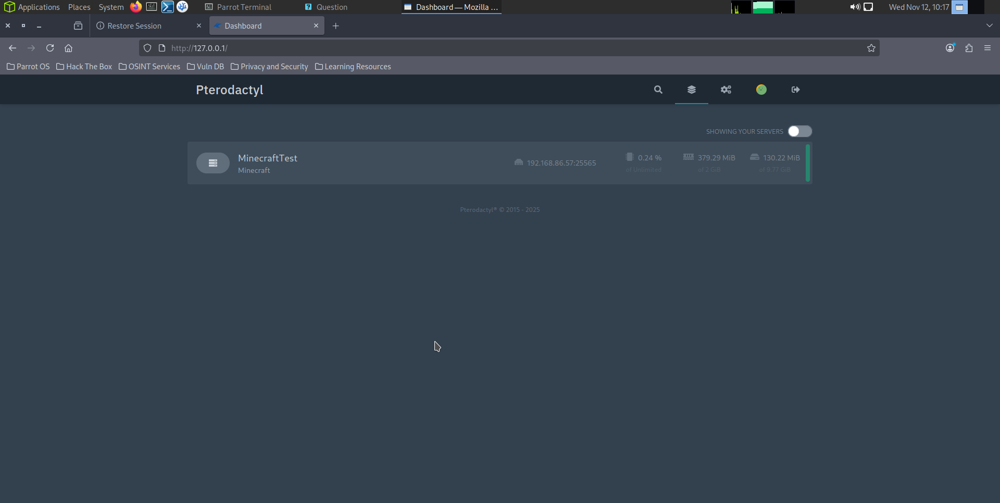
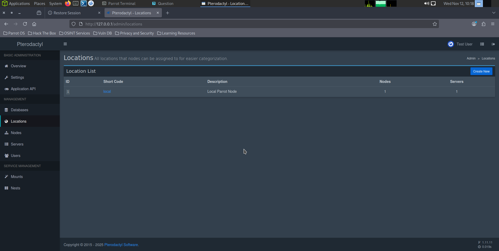
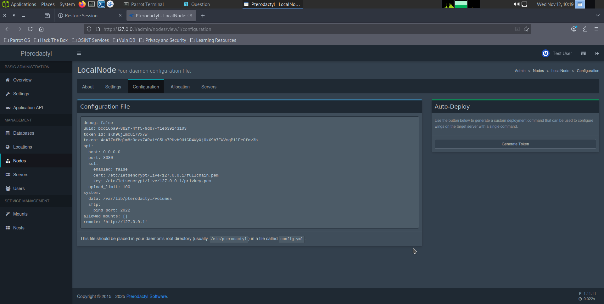
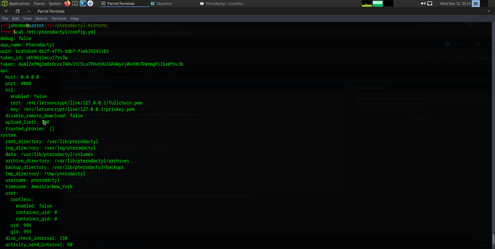
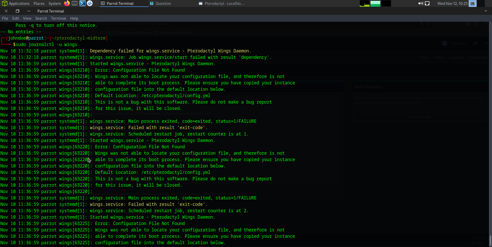
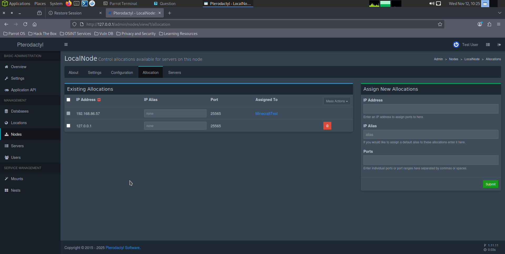
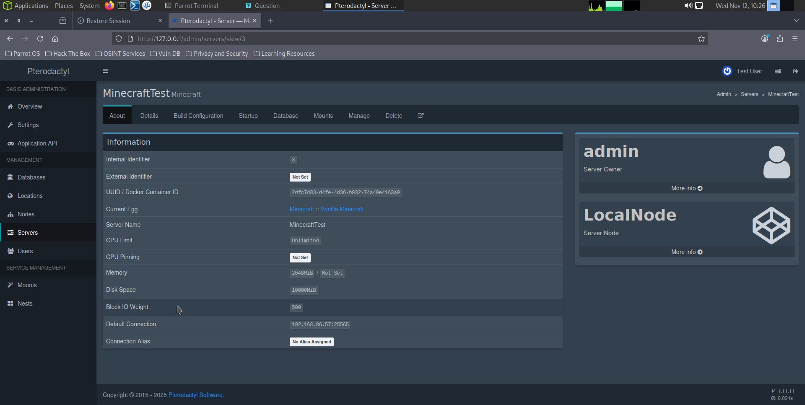
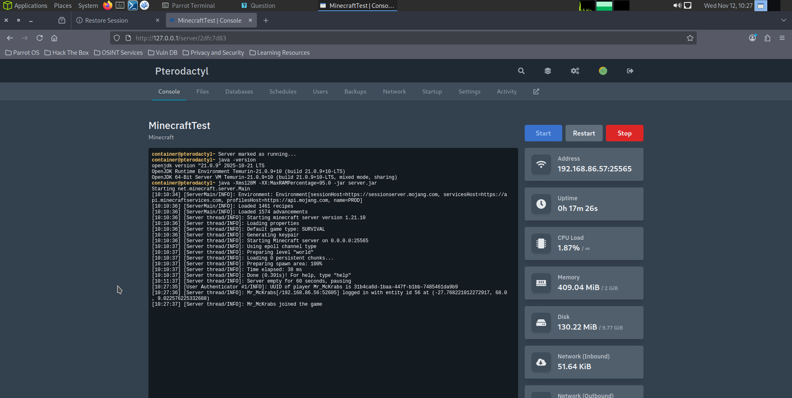
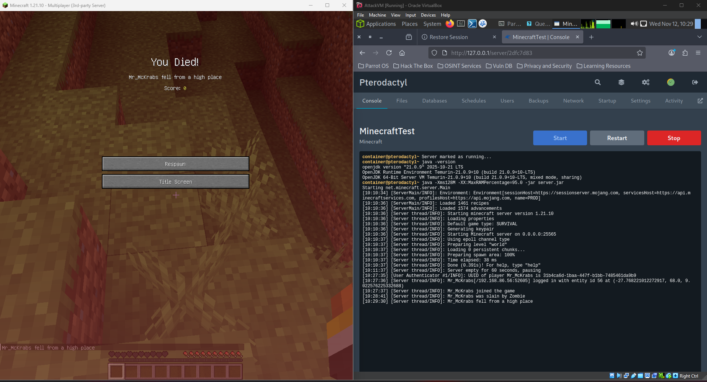
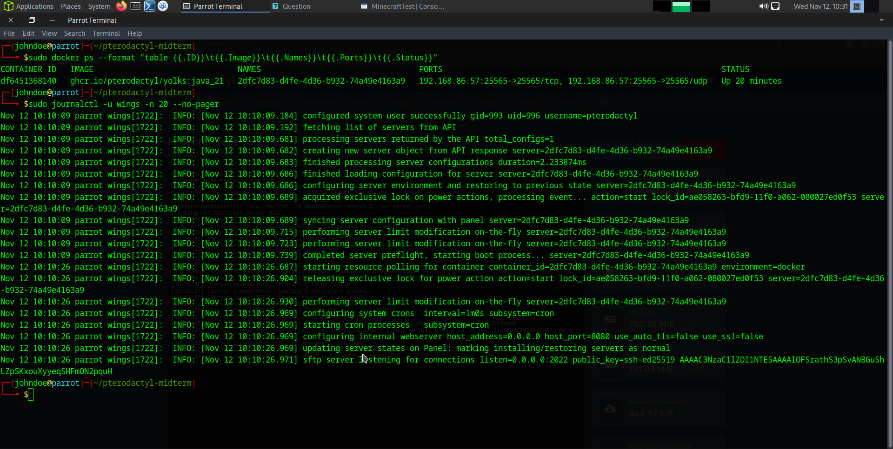

# Pterodactyl Midterm — Full Installation, Configuration & Minecraft Server Deployment

This repository documents a complete Pterodactyl setup on Parrot OS (Debian-based). It includes every step, configuration file, and command used to install, configure, and test the system by deploying a working Minecraft server.

> Note: All credentials and tokens in this repository are placeholders. Replace them when recreating this setup.

---

## Table of Contents

1. Overview
2. System Requirements
3. Installation Steps
4. Configuration Files
5. Systemd Services
6. Testing the Environment
7. Troubleshooting
8. Screenshots
9. Project Structure
10. License

---

## Overview

Pterodactyl is an open-source game server management panel built with PHP, Docker, and Go. This project demonstrates installing both the Panel and Wings (daemon), setting up system services, and deploying a Minecraft server.

The configuration and startup commands are designed for an isolated environment, making this setup ideal for academic and test use.

---

## System Requirements

| Component  | Minimum Version    | Description                      |
| ---------- | ------------------ | -------------------------------- |
| OS         | Debian / Parrot OS | Host OS for panel & node         |
| PHP        | 8.3                | Required for Panel backend       |
| Database   | MariaDB 10.x       | Panel database                   |
| Web Server | NGINX              | Serves the panel frontend        |
| Queue      | Redis              | Background queue handler         |
| Daemon     | Wings              | Handles Docker containers        |
| Docker     | 25.x               | Game server container management |

---

## Installation Steps

### 1. Install dependencies

```bash
sudo bash commands/install-deps.sh
```

This installs PHP, MariaDB, NGINX, Redis, and Docker.

### 2. Download and install the Pterodactyl panel

```bash
mkdir -p /var/www/pterodactyl && cd /var/www/pterodactyl
curl -Lo panel.tar.gz https://github.com/pterodactyl/panel/releases/latest/download/panel.tar.gz
tar -xzvf panel.tar.gz && rm panel.tar.gz
COMPOSER_ALLOW_SUPERUSER=1 composer install --no-dev --optimize-autoloader
cp .env.example .env
php artisan key:generate --force
```

### 3. Configure the database

```bash
mysql -u root -p
CREATE DATABASE panel;
CREATE USER 'pterodactyl'@'localhost' IDENTIFIED BY 'Test1234';
GRANT ALL PRIVILEGES ON panel.* TO 'pterodactyl'@'localhost';
FLUSH PRIVILEGES;
```

Then update `.env`:

```bash
nano /var/www/pterodactyl/.env
```

### 4. Run migrations and seed

```bash
php artisan migrate --seed --force
php artisan p:user:make
```

Create an admin user when prompted.

### 5. Configure NGINX

See `configs/pterodactyl.nginx.conf`:

```bash
sudo cp configs/pterodactyl.nginx.conf /etc/nginx/sites-available/pterodactyl
sudo ln -s /etc/nginx/sites-available/pterodactyl /etc/nginx/sites-enabled/
sudo systemctl restart nginx
```

### 6. Enable cron and queue workers

```bash
(crontab -l 2>/dev/null; echo "* * * * * php /var/www/pterodactyl/artisan schedule:run >> /dev/null 2>&1") | crontab -
sudo cp systemd/pterodactyl-queue.service /etc/systemd/system/
sudo systemctl daemon-reload
sudo systemctl enable --now pterodactyl-queue.service
```

### 7. Install and configure Wings

```bash
curl -Lo /usr/local/bin/wings https://github.com/pterodactyl/wings/releases/latest/download/wings_linux_amd64
chmod +x /usr/local/bin/wings
mkdir -p /etc/pterodactyl /var/lib/pterodactyl/volumes
cp systemd/wings.service /etc/systemd/system/wings.service
sudo systemctl daemon-reload
sudo systemctl enable --now wings
```

Then copy the Token ID and Token from the Panel (Nodes page) into `configs/wings.yml.example` and move it to `/etc/pterodactyl/config.yml`.

---

## Configuration Files

| File                     | Purpose                             |
| ------------------------ | ----------------------------------- |
| `.env.example`           | Environment variables for the Panel |
| `pterodactyl.nginx.conf` | NGINX virtual host config           |
| `wings.yml.example`      | Wings Daemon configuration          |
| `pteroq.service`         | Queue worker definition             |

---

## Systemd Services

| Service                     | Path                                            | Description                   |
| --------------------------- | ----------------------------------------------- | ----------------------------- |
| `wings.service`             | `/etc/systemd/system/wings.service`             | Runs the Wings Daemon         |
| `pterodactyl-queue.service` | `/etc/systemd/system/pterodactyl-queue.service` | Handles artisan queue workers |

Enable and check status:

```bash
sudo systemctl enable --now wings pterodactyl-queue.service
sudo systemctl status wings --no-pager
sudo systemctl status pterodactyl-queue.service --no-pager
```

---

## Testing the Environment

### Create a Minecraft Server

1. Log into the panel as admin.
2. Go to Admin → Locations → Create Location (e.g. `local`).
3. Go to Admin → Nodes → Create Node:

   * Name: `LocalNode`
   * FQDN: `127.0.0.1`
   * Daemon Port: `8080`
   * SFTP Port: `2022`
   * Memory: `4096`
   * Disk: `10000`
4. Paste Token ID and Token from this step into `/etc/pterodactyl/config.yml`.
5. Restart Wings.
6. Add allocation: `127.0.0.1:25565`
7. Create new server → Nest: Minecraft, Egg: Vanilla.
8. Start server and monitor the console.

Check running container:

```bash
sudo docker ps --format 'table {{.ID}}\t{{.Image}}\t{{.Ports}}'
```

To test connection:

* In Minecraft client, connect to: `127.0.0.1:25565`

---

## Troubleshooting

See `notes/troubleshooting.md` for detailed logs and fixes.

Common quick fixes:

```bash
# Wings panic: jwt: HMAC key is empty
sudo nano /etc/pterodactyl/config.yml  # Ensure token_id and token exist
sudo systemctl restart wings

# Fix permissions
sudo chown -R www-data:www-data /var/www/pterodactyl
sudo chmod -R 755 /var/www/pterodactyl/storage /var/www/pterodactyl/bootstrap/cache

# Firewall
sudo ufw allow 80,443,8080,2022,25565/tcp
sudo ufw reload
```

---

## Screenshots

### 1. Panel Login


### 2. Create Location & Node


### 3. Node Configuration


### 4. Wings Configuration


### 5. Wings Journal Log


### 6. Allocation Settings


### 7. Server Creation


### 8. Server Console


### 9. Minecraft Client Connection


### 10. Docker Containers Running



---

## Project Structure

```
pterodactyl-midterm/
├─ README.md
├─ commands/
│  ├─ install-deps.sh
│  ├─ panel-setup-commands.txt
│  ├─ wings-setup-commands.txt
├─ configs/
│  ├─ .env.example
│  ├─ pterodactyl.nginx.conf
│  ├─ wings.yml.example
│  ├─ pteroq.service
├─ systemd/
│  ├─ wings.service
│  ├─ pterodactyl-queue.service
├─ notes/
│  └─ troubleshooting.md
└─ screenshots/
```

---

## License

This project is licensed under the MIT License.

You are free to use and modify this documentation for academic, instructional, and testing purposes.
